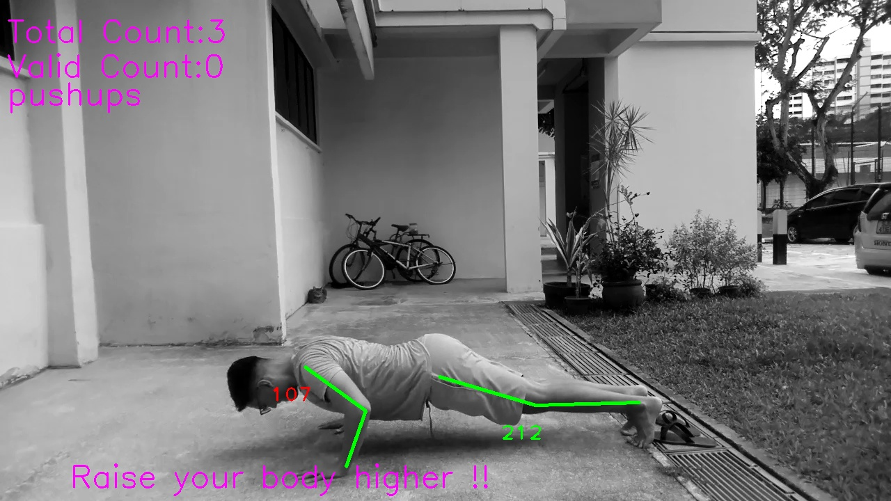

## SECTION 1 : PROJECT TITLE
## Intelligent Sensing System Project - Gym Buddies

---

## SECTION 2 : EXECUTIVE SUMMARY / PAPER ABSTRACT
Incorrect form is one of the leading factors of injury when performing exercises. This project aims to help users identify mistakes via real-time or with a pre-recorded video when performing squats or push-ups. This is done via a visual feedback made possible by a combination of methods from pose-estimation, 3D-CNNs, statistical approaches and a rules engine with an input of a pair of synchronised monochrome and disparity videos. The visual feedback provides information on the exercise being performed, the number of completed repetitions, a highlight of the users pose where mistakes are made and the number of failed repetitions. The interface is available via both command-line as well as a web-interface.

---

## SECTION 3 : CREDITS / PROJECT CONTRIBUTION

| Name  | Student ID  | Work Items | Email |
| :------------ |:---------------:| :-----| :-----|
| Mohamed Mikhail Kennerley | A0213546J | • Pose Feature Extraction  • Mono-D Dataset  • 3DCNN Classifier| e0508649@u.nus.edu |
| Vidish Metha | A0213523U | • Repetition Counting  • LBP-SVM / 2DCNN  •  Web Interface| e0508624@u.nus.edu|
| Oh Chun How | A1234567C | • Rules Engine  • HoG-SVM  • Initial Dataset| Chunhow.oh@u.nus.edu |

---

## SECTION 4 : VIDEO OF SYSTEM MODELLING & USE CASE DEMO

---

## SECTION 5 : USER GUIDE
**Step 1**: Download videos at: https://drive.google.com/drive/folders/15cHzsHID29E2F2-_q_6-2ybPo4frhe32?usp=sharing  
**Step 2**: Create a new conda environment with conda_requirements.txt  
*$ conda create --name env --file conda_requirements.txt*  
**Step 3**: Install other requirements via pip  
*$ pip install -r pip_requirements.txt*  
**Step 4**: In visionSysPre folder run:  
*$ python main.py --mono "Mono video file" --depth "Depth video file"*

#### Frontend-Interface

**Step 1**: Create a new conda environment with web_requirements.txt (within GymBuddyWeb folder) 
*$ conda create --name env --file conda_requirements.txt*  
**Step 2**: Collect the static files 
*$ python manage.py collectstatic*  
**Step 3**: Serve the web interface in local host 
*$ python manage.py runserver*

---
## SECTION 6 : PROJECT REPORT / PAPER

Refer to project report: Report-GymBuddies  
